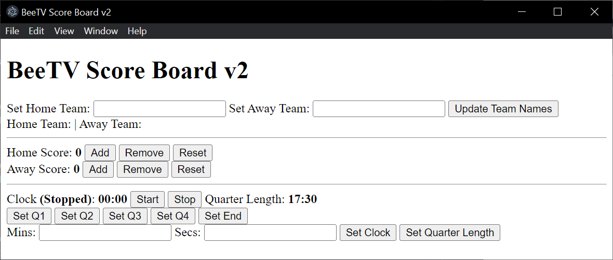
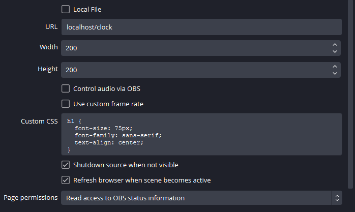

# Project-Charon

BeeTV LiveStream ScoreBoard v2

- [Project-Charon](#project-charon)
  - [Prerequisites](#prerequisites)
  - [Installation Instructions](#installation-instructions)
  - [Running the application](#running-the-application)
    - [Explanation of Functionality](#explanation-of-functionality)
      - [Buttons](#buttons)
      - [API Responses (GET)](#api-responses-get)
      - [Misc Functionality](#misc-functionality)
  - [OBS Setup](#obs-setup)

## Prerequisites

- NodeJS installed (v20 supported, other versions may work) - see https://nodejs.org/en
- Ability to pull packages from npm (Global npmrc config)
- Ability to run localhost APIs

## Installation Instructions

**Clone the repo**

```shell
git clone https://github.com/JoshR44/Project-Charon.git {FODLER_NAME}
```

**Enter cloned directory**

```shell
cd {FODLER_NAME}
```

**Install dependencies**

```shell
npm i
```

**Build the application**

```shell
npm run build
```

## Running the application

Run the application using the following command while in the installed directory

```shell
npm run start
```

You'll be presented with the following window:



### Explanation of Functionality

#### Buttons

- **Update Team Names** - Uses the input from the `Set Home Team` & `Set Away Team` boxes to set the homeTeam & awayTeam
- **Add/Remove/Reset** - Adds 1 to the score | Removes 1 from the score | Resets the score to 0
- **Start/Stop** - Starts / Stops the match clock
- **Set Q1/Q2/Q3/Q4** - Sets the match clock to the starting point of each quarter, based on the Quarter Length. I.E. hitting `Set Q2` will set the clock to `17:50` under default settings.
- **Set End** - Sets the clock to the end of Quarter 4, based on the Quarter Length. I.E `70:00` under default settings.
- **Set Clock** - Sets the match clock to a custom value based on the inputs in the `Mins` & `Secs` boxes.
- **Set Quarter Length** - Sets the quarter length based on the inputs in the `Mins` & `Secs` boxes. Defaults to `17:30`

#### API Responses (GET)

- **/clock** - Gets the value of the match clock
- **/homeScore, /awayScore** - Gets the current score
- **/homeTeam, /awayTeam** - Gets the current team names

#### Misc Functionality

- **Automatic clock stop** - The clock will automatically stop at the end of every quarter based on the current quarter length
- **Format of API Responses** - Since this is designed for use with OBS, the API responses are send as HTML H1 fields, which allows CSS formatting in OBS

## OBS Setup

The various API's can be setup as browser sources in OBS that will refresh.

> [!WARNING]  
> The ScoreBoard app needs to be running in order to display anything in OBS.
> If the ScoreBoard app is closed or crashes for whatever reason the scene needs to be refreshed for any changes to be reflected in OBS

**Instructions**

- Add browser source
- Set URL to `localhost/{ENDPOINT}` - I.E. `localhost/clock`, endpoints listed above under [API Responses (GET)](#api-responses-get)
- Set width/height as required
- Set custom CSS as required
- Tick `Shutdown source when not visible` top stop unnecessary API requests
- Tick `Refresh browser when scene becomes active`

**Example Custom CSS**

```CSS
h1 {
  font-size: 75px;
  font-family: sans-serif;
  text-align: center;
}
```

**Example of OBS setup**


